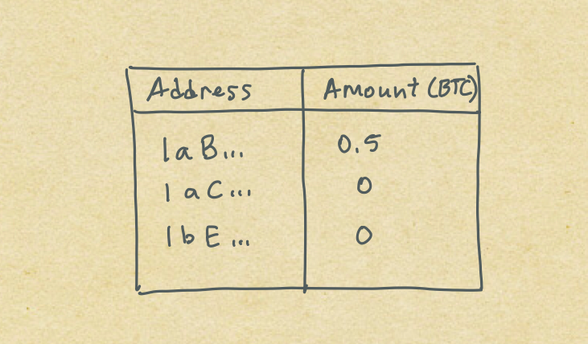
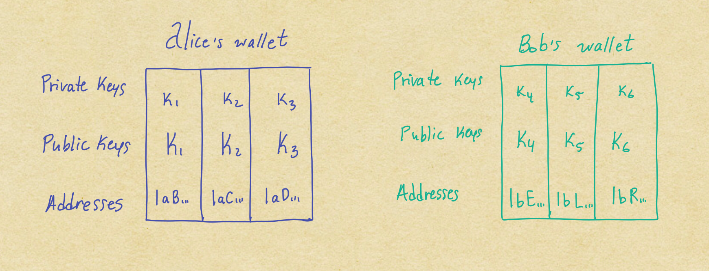

# Bitcoin

About nine years ago, somebody calling themselves
**Satoshi** sent [an email](http://www.metzdowd.com/pipermail/cryptography/2009-January/014994.html)
introducing the first version of the Bitcoin software.
When this software is active, the computer running it
becomes a **Bitcoin node**. Such nodes link up with
each other to form the **Bitcoin network**. The Bitcoin
network has its own native currency called the
lower-case **bitcoin**. There's only ever going to be
21 million bitcoin, which have started to acquire value,
because people find the properties that the currency has
useful. Bitcoin represents a new kind of system, and might
come to have rather wide-ranging impact on the world.

Although Bitcoin exists to solve problems for people, and
it is the beliefs of people that gives bitcoin value, it
is still fundamentally a system of software. This article
will for this reason try to explain what the Bitcoin
software actually **is**, which will help understand why
many of us find it so interesting, and make it easier to
make good decisions about how to interact with or attempt
to modify Bitcoin. I will try to avoid making the
explanation more complex than necessary, but I will need
to introduce some concepts like public key cryptography
and hashing.

* todo: mention lineage of satoshi client -> bitcoin core *

## Bitcoin software

The Bitcoin software is a program written in the C++
programming language, which if you run it makes your
computer a **Bitcoin node**. In the months and years
after Satoshi's initial emails, more and more people
started developing that software and running nodes, and
more recently people started exchanging bitcoin for
traditional currency like US dollars and Euros and
selling goods and services for bitcoin. A dollar bill
can't be eaten and isn't particularly pretty, but it can
be exchanged for bread or a ticket to an art gallery
because other people believe it has value. The bitcoin
currency, which is listed on exchanges as BTC, is just
the same. A price really is only an abstracted way of
describing the value of something.

Each Bitcoin node connects to other nodes, and sends
messages to those nodes to find other nodes it doesn't
yet know about. The way those nodes talk to each other
describes the **Bitcoin protocol**.

## Public key cryptography

The Bitcoin software uses public key cryptography to
generate pairs of **public** and **private** keys.
In Bitcoin, the addresses used to receive transactions
are derived from public keys, while the private keys stay
secret and never should be revealed to anyone. The
private keys can be used to **sign transactions**, which
typically is what allows the bitcoin to be transferred to
a new address. These signatures can be validated by
anyone that has the corresponding public key, so each node can check that the holder of the private key
was the one that originated the transaction.

**Bitcoin wallets** are just software that helps us
keep track of a collection of private keys,
as well as how many bitcoin are controlled by those
keys. The wallets normally use a new address every time
we receive bitcoin, which helps with privacy. By
handling the details of managing private keys, summing
up the bitcoin controlled by those keys, and signing
transactions, the barrier to entry is lowered by
using wallets compared to if we needed to understand
these concepts ourselves.

We can visualize a user Alice's wallet as a bag of
private keys, some of which might be used to unlock
lockboxes holding her bitcoin. In the image below,
the `k1` key can be used to unlock a lockbox holding
0.5 BTC.

## Transactions

Each transaction has **inputs** and **outputs**, or
debits and credits. There's actually no coins and no
balances in the protocol, but we can still think of 
"having 0.25 BTC" as a useful simplification. The way
Bitcoin works is that each transaction arrives at a
specific point in time, and by following the flow of
transactions, we end up with a view of who owns what
coins. In the image below, the address starting with
`1aB...` has 0.5 BTC as unspent outputs, while the
other two addresses don't have any unspent outputs.

The way we know that a public address owns a
coin is that it has outputs which no subsequent
transaction spends as inputs.

Bitcoin outputs are indivisible, just like physical
dollar or Euro bills, so if we want to spend less than
the entire output we need to get some change back to one
of our own addresses.

In the image below, the users Alice and Bob's wallets
are shown. As a reminder, a wallet is a collection of
private keys, from which the corresponding public key
and address can be calculated.

If Alice sends 0.25 BTC to Bob, what's going on is that
Alice has some unspent transaction outputs summing to
at least 0.25 BTC, which she uses to create a new
transaction with those outputs as inputs, requiring
Bob's signature to spend the new output in the future.

Only transactions signed by a specific private key
corresponding to the transaction output are seen by the
software as valid. The Bitcoin software add up all
unspent outputs or **UTXOs**, which displays the balance
controlled by the node's private keys in BTC. There's no
central authority to say what's valid or not, but each
node independently checks the transactions it receives
and only accepts the ones it deems to be valid.

We can now understand what actually is going on when we
"have 0.25 BTC". That's the case where we control private
keys which control unspent transaction outputs that sum
up to that amount. When we go through all transactions in
the history of Bitcoin, if we find some transaction
outputs with no subsequent transactions using them as
inputs, they are available for spending.

## Mining

New bitcoin are generated by certain full nodes on the
network, called **miners**. The miners produce new
bitcoin by solving a specific mathematical puzzle, which
if solved produces some newly issued bitcoin, as a reward
from the network called **coinbase**. The coinbase reward
started out at 50 BTC per block, and every 210,000 blocks
or 4 years it is reduced by half. This ensures that the
rate at which new bitcoin is issued is predictable and
ends up with 21 million bitcoin in total by 2140.

The puzzle that miners solve involves finding inputs to
the SHA256 **hash function** that are lower than a
specific target value, called the **difficulty**. Hash
functions are by their nature one-way, so there's no way
to predict which input values will result in a desired
output, and miners just try different input values until
they find one lower than the difficulty by chance. Solving
this puzzle proves that the miner spent a certain amount
of work trying random input values to the hash function,
so it is called a Proof-of-Work.

## Blocks

The correct solution to the puzzle is a hash value, which
becomes part of a block. A block is a group of
transactions packaged together, along with some extra
data like the solution to the puzzle. The puzzle is set
up in such a way that the hash value that the miners find
also validates that all transactions are part of the
block, using a Merkle hash. This is a type of hash which
makes it easy to check whether a specific transaction was
part of that block or not.

## Blockchain

The blocks also reference the previous block, forming a
chain of blocks. The very first block is called the
genesis block, and is included in the source code of the
Bitcoin software. The difficulty value for the puzzle is
adjusted by the Bitcoin software every 2016 blocks, and
targets a rate of block production of one block every 10
minutes. Since the puzzle involves finding an input to a
hash function, the blocks are produced every 10 minute on
average only, and can arrive faster or slower than that
as well.

This means that every Bitcoin node starting up for the
first time can start talking to other nodes around it,
gradually retrieving blocks from the genesis block onward,
and for each block it can verify that the Proof-of-Work
is valid, and that all the transactions are valid. If a
malfunctioning or malicious node feeds our node invalid
blocks, it will simply be ignored. If there's several
valid chains available, our node will follow the chain
that has the most accumulated work behind it.

The 10 minute rate of block production gives plenty of
time for the entire network to hear about the latest
blocks, which is important for miners so they don't waste
effort trying to mine blocks on the wrong branch of the
chain.

Since every node has a copy of the entire blockchain, and
every transaction is stored on the blockchain forever, it
is important to not use that limited space frivolously.
Every transaction has inputs and outputs, and by making
the sum of the outputs slightly less than the sum of the
inputs, we can implicitly leave a transaction fee for the
miners.

The miners who follow the correct rules will receive the
coinbase reward, as well as all transaction fees of the
transactions in the block they mine. This means that a
miner likely will include transactions with higher fees
before those with lower fees, so only the cases which
people value enough to pay sufficient mining fees getmined.

## Limitations

This system can at most fit a handful of transactions
every second, and the average 10 minute block production
means that the time to wait until our transaction is mined
into a block is fairly long, as well as unpredictable. In
order to really be certain that we are in control of our
bitcoin, we would need to run our own full nodes, and be
very good at protecting our private keys, both of which
raises the barrier to entry.

Popular mobile wallets for Bitcoin like Copay, Mycelium
and Samourai, are using a simplified verification protocol
called SPV. This protocol involves retrieving just the
block **headers**, since mobile clients don't have enough
storage space or network bandwidth to retrieve the full
blocks. This means that the security properties of these
lightweight clients is less good than the full nodes,
since they don't verify all the rules.

There are many kinds of things we might want from digital
money where the Bitcoin blockchain itself is not directly
suitable for these reasons, so we need to keep building
more systems to solve those problems.
